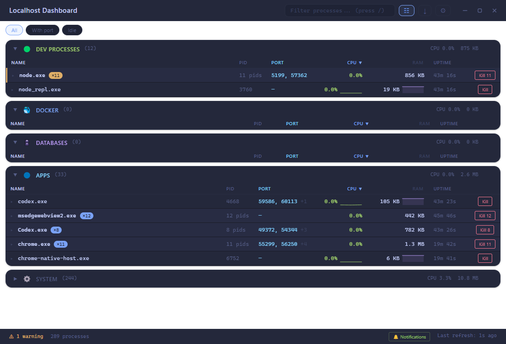

# localhost-dashboard

Developer-focused task manager for Windows, built with Electron. It watches everything running on your machine that matters while developing — dev servers, Docker containers, databases, listening ports — and alerts you when something misbehaves.



## Features

- **Process groups** — running processes classified into Dev / Docker / Databases / Apps / System, with CPU, RAM, start time and sparkline history.
- **Ports** — listening ports per process (`netstat`/`ss`/`lsof`), with port-conflict detection.
- **Docker** — running containers with their published ports.
- **Anomaly alerts** — desktop notifications for port conflicts, sustained high CPU/RAM, and runaway duplicate dev processes.
- **Process actions** — kill or bulk-kill, expandable details (command line, connections, child processes), pinning, clustering of identical processes.
- **Service profiles** — start or stop a named set of commands (e.g. your whole dev stack) in one click.
- **Quality of life** — filtering with keyboard shortcuts, JSON snapshot export, tray icon with minimize-to-tray, autostart, dark/light theme, frameless window with Windows 11 Mica backdrop.

## Getting started

```bash
npm install
npm start
```

Primarily built for Windows; process, port and Docker collection have Linux/macOS fallbacks.

## Architecture

```
main/collectors/   process, port, docker, detail collection (polled every 1–10 s)
main/services/     classification, anomaly detection, config, kill, notifications
main/ipc-handlers  thin validated IPC surface
renderer/          vanilla JS UI with a small custom DOM reconciler — no frameworks
```

The only runtime dependency is [systeminformation](https://github.com/sebhildebrandt/systeminformation).

## Security

- `contextIsolation: true`, `nodeIntegration: false`, minimal `contextBridge` preload.
- Content-Security-Policy in the renderer; no dynamic `innerHTML`.
- External URL opening restricted to http(s)/localhost; PIDs validated before any kill.
